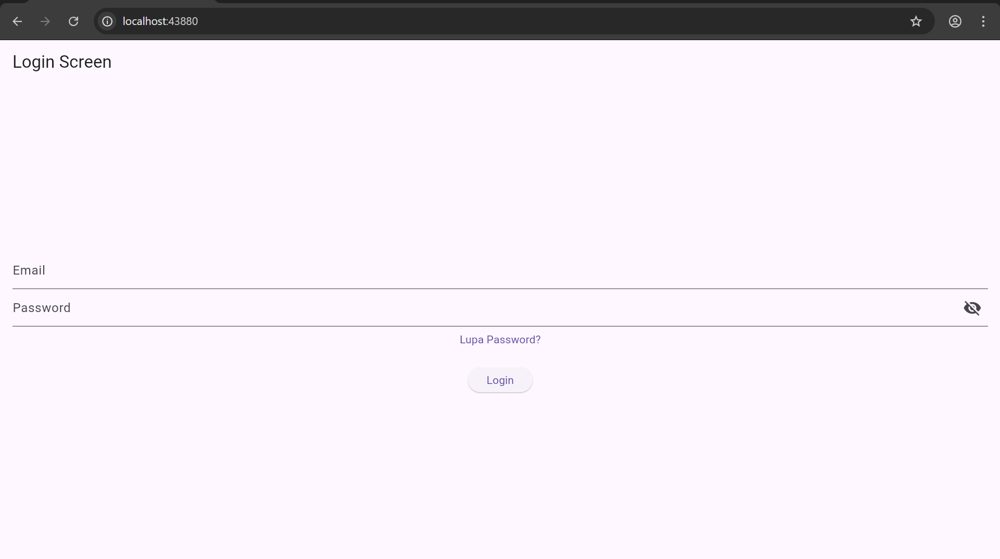
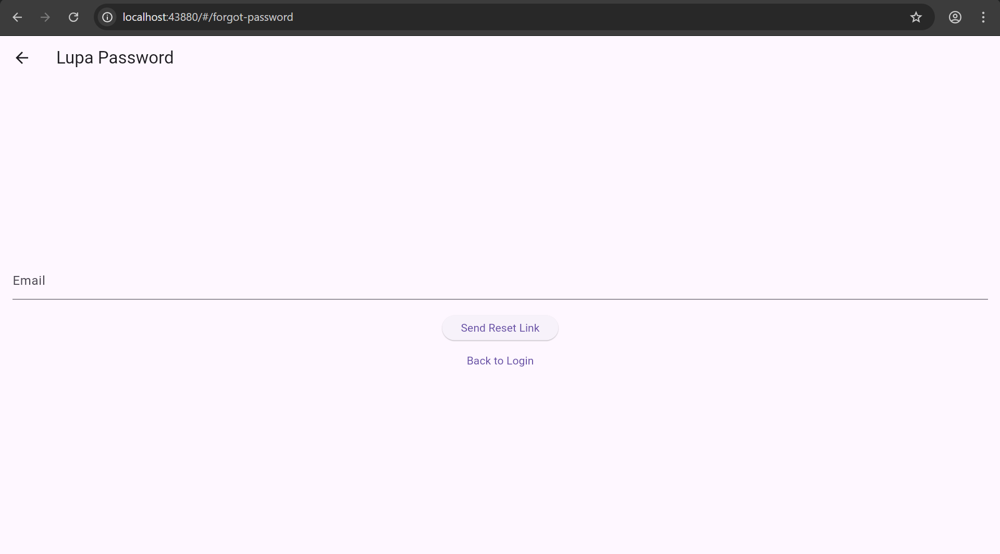
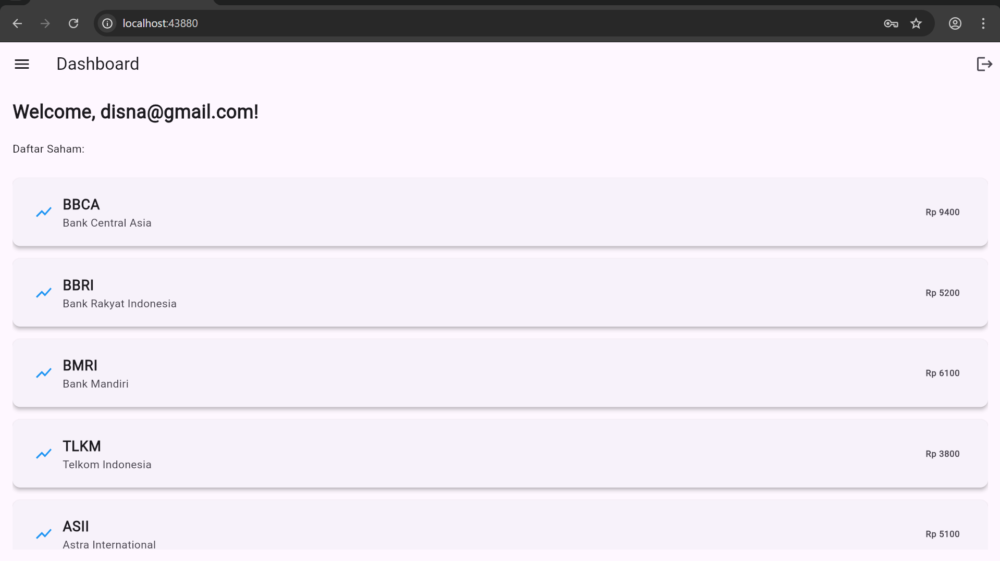

# uts_mobile

Project Flutter untuk aplikasi mobile sederhana dengan halaman login, lupa password, dan dashboard daftar saham.

## Struktur Folder

```text
lib/
  main.dart
  screens/
    forgot_password.dart
    home.dart
    login.dart
    profile.dart
  widgets/
  models/
  utils/
```

## Isi Folder

- `lib/main.dart` berisi konfigurasi awal aplikasi dan route.
- `lib/screens/login.dart` berisi halaman login.
- `lib/screens/forgot_password.dart` berisi halaman lupa password.
- `lib/screens/home.dart` berisi halaman dashboard.
- `lib/screens/profile.dart` disiapkan untuk halaman profil.
- `lib/widgets/` disiapkan untuk komponen yang bisa dipakai ulang.
- `lib/models/` disiapkan untuk struktur data.
- `lib/utils/` disiapkan untuk helper, konstanta, atau konfigurasi tambahan.

## Halaman

- `LoginScreen`


- `ForgotPasswordScreen`


- `DashboardScreen`



## Menjalankan Project

```bash
flutter pub get
flutter run
```
